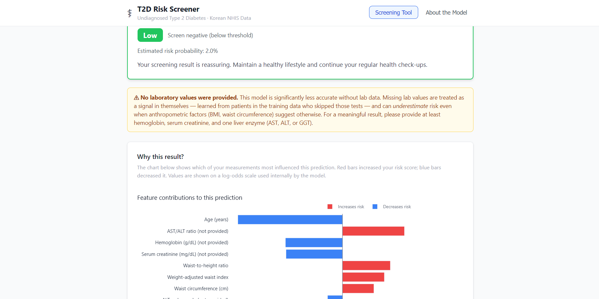
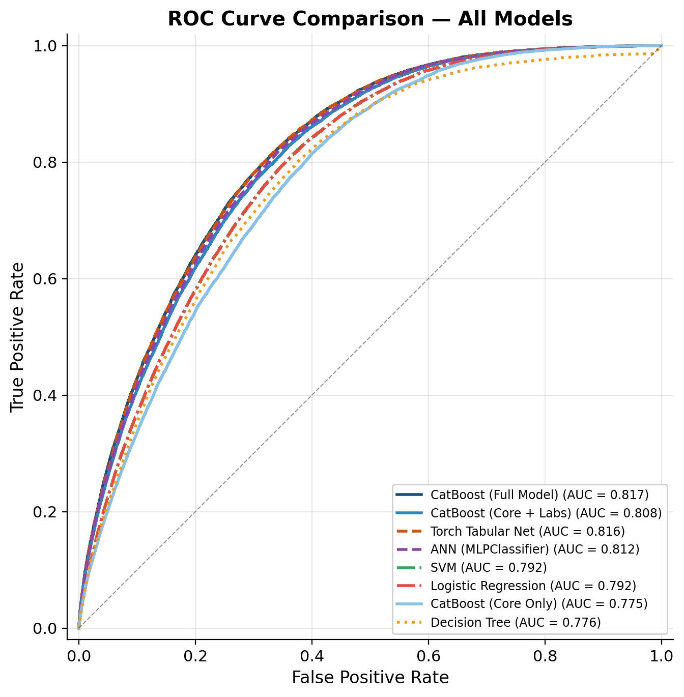
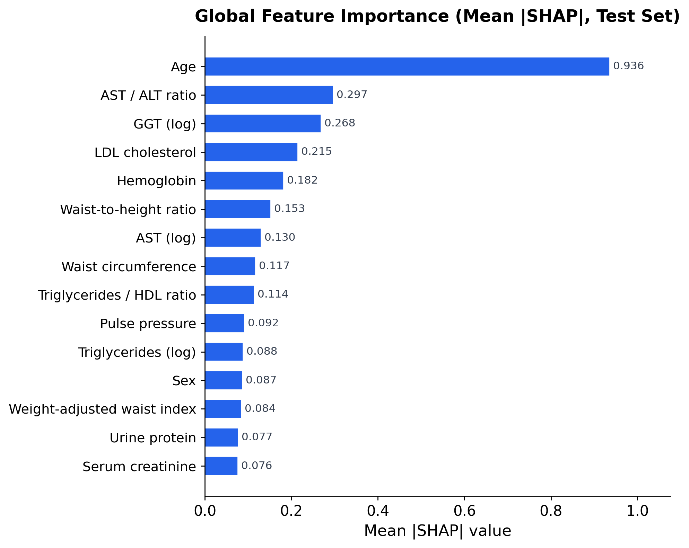

# T2D Risk Screener

**Machine learning-based screening for undiagnosed Type 2 Diabetes using ~1 million Korean National Health Insurance Service (NHIS) health checkup records.**

CDS-492 Capstone in Data Science | George Mason University | Spring 2026

<p align="center">
  
</p>

## Overview

An estimated 44.7% of the 537 million adults with diabetes worldwide are undiagnosed. Routine health checkups collect anthropometric, blood pressure, and laboratory data that collectively contain latent signals for undiagnosed diabetes, but clinicians reviewing individual test results in isolation can miss the subtle multi-variable patterns that a machine learning model can detect.

This project trains a **CatBoost** gradient-boosted tree classifier on the 2024 NHIS General Health Examination dataset (~994,000 anonymized adult records) to flag individuals at elevated risk of undiagnosed T2D -- defined as fasting plasma glucose (FPG) >= 126 mg/dL -- using only indirect metabolic indicators available from a standard health checkup. FPG itself is excluded from the model inputs to avoid circular prediction.

A deployed **web-based screening tool** translates the model's calibrated probabilities into four actionable risk tiers (Low / Moderate / High / Very High) with per-prediction SHAP explanations.

## Key Results

<table>
  <tr>
    <td width="50%">
      <table>
        <tr><th>Metric</th><th>Value</th></tr>
        <tr><td>ROC-AUC</td><td><b>0.817</b></td></tr>
        <tr><td>Sensitivity</td><td><b>85.2%</b></td></tr>
        <tr><td>Specificity</td><td>62.5%</td></tr>
        <tr><td>NPV</td><td><b>98.0%</b></td></tr>
        <tr><td>PR-AUC</td><td>0.273</td></tr>
        <tr><td>Brier Score</td><td>0.064</td></tr>
      </table>
    </td>
    <td width="50%">
      
    </td>
  </tr>
</table>

Eight model configurations were compared on identical stratified splits. CatBoost matched neural network architectures (PyTorch Tabular Net, sklearn MLP) within 0.005 AUC while providing native exact SHAP values, native missing-value handling, and CPU-only inference.

## Feature Importance

<p align="center">
  
</p>

Age dominates all other features (mean |SHAP| = 0.936), followed by liver enzyme ratios, lipid markers, and anthropometric measures -- all consistent with established clinical risk factors for T2D.

**Three-tier feature ablation** reveals that adding routine lab tests to core screening measurements yields the largest gain (+0.033 AUC), while the optional lipid panel adds only marginal improvement (+0.009):

| Feature Set | Features | ROC-AUC |
|-------------|----------|---------|
| Core Only | 15 | 0.775 |
| Core + Labs | 26 | 0.808 |
| Full | 40 | **0.817** |

## Repository Structure

```
.
├── paper/                     # IEEE conference paper (LaTeX source + compiled PDF)
│   ├── main.tex               # Paper entry point
│   ├── sections/              # Modular section files (01-08)
│   ├── figures/               # Paper figures
│   └── references.bib         # Bibliography
│
├── code/
│   ├── t2d-screener/          # Production codebase
│   │   ├── api/               # FastAPI backend
│   │   ├── frontend/          # Vanilla JS screening interface
│   │   ├── src/               # Model, preprocessing, config
│   │   ├── models/            # Trained CatBoost model + calibrator + metadata
│   │   ├── figures/           # Generated figures (ROC, SHAP, confusion matrix)
│   │   ├── scripts/           # Figure generation scripts
│   │   ├── notebooks/         # Tutorial notebook
│   │   ├── train.py           # Training pipeline
│   │   ├── MODEL_CARD.md      # Model documentation
│   │   └── README.md          # Setup and usage guide
│   └── notebooks/             # Exploratory analysis notebooks
│
├── presentations/
│   ├── deck/                  # Final milestone presentation (PPTX)
│   ├── modules/               # Weekly milestone submissions (PDF)
│   └── poster/                # COS Colloquium research poster
│
└── docs/                      # Data dictionary and column descriptions
```

## Getting Started

```bash
# Clone the repository
git clone https://github.com/tjohns94/cds492-team-3c.git
cd cds492-team-3c/code/t2d-screener

# Install dependencies
pip install -r requirements.txt

# Run the screening tool
uvicorn api.main:app --reload
# Open http://localhost:8000 in your browser
```

See [`code/t2d-screener/README.md`](code/t2d-screener/README.md) for full setup, training, and figure regeneration instructions.

## Data Source

[2024 NHIS General Health Examination](https://www.data.go.kr/en/data/15007122/fileData.do) -- a publicly released random sample of ~1 million adult subscribers who received a health checkup in 2024. The raw data is not included in this repository; download it from the Korean data portal using the link above.

## Team

| Name | Role | Contact |
|------|------|---------|
| **Tyson Johnson** | Team Lead | tjohns94@gmu.edu |
| **Alizeh Murtaza** | Team Member | amurtaz2@gmu.edu |
| **Nithila Neethi Devan** | Team Member | nneethid@gmu.edu |
| **Tariq Abdulhak** | Team Member | tabdulha@gmu.edu |

**Faculty Advisor:** Dr. Mohamed Adel Slamani (aslaman@gmu.edu)

Dept. of Computational and Data Sciences, George Mason University

## License

MIT License. See [LICENSE](LICENSE).
